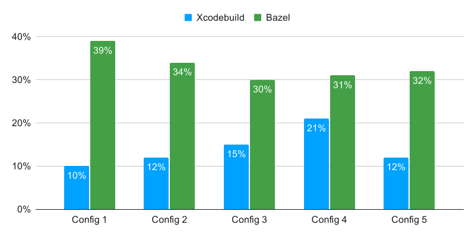

Companies have to protect their systems and intellectual property. At the same time, they have to ensure that their employees are productive. Security software installed on employee machines tries to fulfill the needs of the former without negatively impacting the latter. Sometimes though, either through misconfiguration or fundamentally flawed goals, this software can negatively impact productivity in a big way.

<!-- excerpt -->

For the past couple years I've partly to primarily focused on iOS developer experience, where my clients have been the engineers that have actually worked on the iOS apps. This essentially means making sure engineers can do their work as easily and joyfully as possible. Developer experience can be improved in many ways, from writing tools, to tweaking the CI/CD process, to reducing the amount of time it takes a project to compile. Today I'm going to focus on that last one, and how security software impacts it.

## Background

One of the projects I was responsible for was large, modular, and written in Swift. This had the consequence of having vastly different compile times depending on which part of the project was being modified. We were also migrating from one build system to another, each with different performance characteristics.

While looking into the performance difference between the two build systems, I noticed that lots of resources, primarily CPU, were being used by non-compile related processes during our compiles. It also seemed to affect one build system more than the other. I believed that this was negatively impacting our compile times, so I decided to perform some benchmarks.

I focused on incrementally compiling the project in various configurations and with the two different build systems. Most engineers incrementally compile the project, starting from an already compiled state, modifying part of the project, and recompiling. We want this recompile to be as fast as possible as it directly impacts engineer productivity. Slow recompiles impact the development feedback loop of Edit, Compile, and Run, which directly impacts an engineer's velocity. Also, the slower a recompile is, the higher the chance that the engineer context switches (e.g. communicates on Slack, checks their email, or reads a web page), which can change a sub-minute recompile into a multi-minute interruption.

## Benchmarking

The five configurations I chose represented some of our primary developer patterns: leaf dependency edits, middle dependency edits, root dependency edits, bundling, and non-bundling. For simplicity, I'm going to refer to them as Config 1 through Config 5 (and they don't line up exactly with the previous list). The two build systems we used were Xcodebuild and Bazel.

To get a baseline for the benchmarks I recompiled the project in the five configurations and with both build systems. For each configuration I performed the recompile three times, throwing out the highest, and averaging the remaining two. This ensured that the data was consistent, though the times collected for all three were usually within a second or two of each other anyway.

I then went offline and disabled the security software that I had noticed taking up resources. I performed the same recompiles as before. Here were the results:

<figure>

<figcaption>Chart showing how much slower the security software makes recompiling</figcaption>
</figure>

0% on this chart is the amount of time taken for a recompile of that configuration/build system with the security software disabled. A result of 39% means that with the security software enabled the recompile took 39% longer. Or to put it another way, the recompile is 28% faster with the security software disabled. This is comparable to the improvement we saw when going from 4-cores to 6-cores in our MacBook Pros.

The first thing I want to highlight is that for Xcodebuild, which is the build system we were migrating away from, the impact of the security software makes recompiles 10-15% slower. Ideally this would be near 0%, by whitelisting the processes or directories used for the recompile.

The second thing is that for Bazel the impact is much higher, resulting in recompiles that are 30-39% slower. My theory here is that some whitelisting had happened for the Xcodebuild use case but not as much for the Bazel one.

## Conclusion

Clearly, the security software was negatively impacting our project's compile times. Our friends on the Android team were experiencing the same thing.

It doesn't have to be this way, either through configuration changes or outright removal of the software.

"Remove the security software? He can't be serious." But I am. Take Apple as an example: they don't install this sort of software on their employee's machines, their IP is really valuable, and they even deal with PCI issues. If they can secure their interests without installing onerous software on their fleet, then so can everyone else. Also, in the last couple release notes for Xcode they call out the following:

> Third-party “endpoint security” software may cause slow simulators, system freezes, or prevent debug processes from running in simulators reliably. This sometimes manifests as `debugserver` disconnections, or sends simulator applications a SIGKILL signal.
>
> **Workaround:** Uninstall the third-party software.
>
> -- [Xcode 11.4 release notes](https://developer.apple.com/documentation/xcode_release_notes/xcode_11_4_release_notes#3530436)

In the end, we were able to fix some software's configuration and stop using some of the other ones, but others continued to negatively impact developer experience. You can't win them all 🤷‍♂️.
