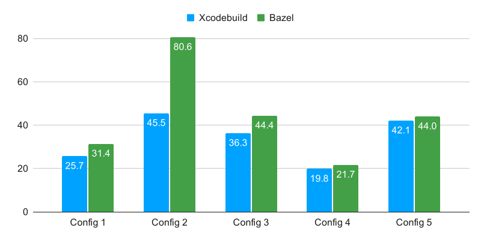
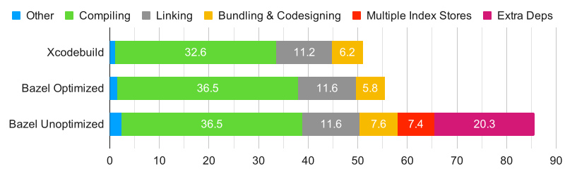

Bazel's tagline is "{Fast, Correct} - Choose two". Why then did I spend two weeks investigating why Bazel was incrementally compiling a large modular Swift app a lot slower than Xcode? Bazel's tagline isn't wrong, there is just a hidden asterisk on "Fast" 😉. Thankfully the results of the investigation lead to some changes in our use of Bazel and how it was integrated with Xcode, which lead to most of the slowdowns being eliminated.

<!-- excerpt -->

## Background

Before digging into the results of my investigation, let's unwrap what it means for Bazel to claim that it's both "Fast" and "Correct".

Bazel achieves correctness primarily in two ways: by tracking every input for every node in the build graph, and by building each node in an isolated fashion. This results in a builds that are reproducible and free of staleness issues. On its own this correctness actually makes Bazel slower than other build tools, since it's doing "more" for any given build.

How does Bazel claim to be fast if its correctness makes it slower? By being correct as a base, further optimizations and technologies can be leveraged: incremental builds always work without having to perform a clean, build artifacts can be locally and remotely cached, and building can be parallelized across multiple machines (i.e. remote execution). All of these can result in much faster builds, especially when rebuilding an entire project (versus an incremental change).

Besides remote execution, we already leveraged all the technologies that can make Bazel builds fast. Incremental compilations though are tricky for Bazel to speed up, since the inputs, and thus most of the outputs, are unique to the local edits being made. Xcodebuild (Xcode's built in build system) is able to take shortcuts that violate Bazel's correctness model. My hypothesis before starting the investigation was that this difference would be the root of our issues.

## Measuring

To fix a problem it helps to fully understand what the problem is. In our case, that meant taking detailed measurements of builds in Xcode with both build systems. Along the way, I noticed that our corporate security software was impacting the Bazel builds proportionately more than our Xcodebuild builds (see my [other article](2021-01-09-Corporate-Crapware.md) for more details on this). To ensure my numbers were as accurate as possible, I performed the measurements with the security software disabled.

An iOS app can have many different types of build actions: compiling Swift, compiling Objective-C, linking compiled code to form executables, processing resources, bundling it all together into a `.app`, and applying code signing to the bundle(s). Since I knew incremental builds were slower, but not sure what part of the build was slower, I decided to test a few different configurations:

- **Config 1**: Building the app, with it's main module modified. This is the smallest incremental code change one can make while building/running the application. It breaks down to about 1/4 code compiling, 1/2 linking, and 1/4 bundling and code signing.
- **Config 2**: Building the app, with a slightly upstream module modified. This emulates causing more code to be compiled, mostly in parallel, but otherwise is very similar to Config 1.
- **Config 3**: Building the a test bundle, with the module under test modified. This emulates editing a module to get its tests to pass (i.e. Test Driven Development). It is very similar to Config 1, but involves two modules compiled serially, a smaller bundle, and different code signing characteristics.
- **Config 4**: Building a leaf module, with the only the module modified. This emulates editing a module, simply trying to get it to compile. It is essentially Config 3, without anything test bundle related, meaning no bundling, code signing, or linking: just 100% code compilation.
- **Config 5**: Building a leaf module, with an decently upstream module modified. This emulates editing a decently upstream dependency, but only building what is needed for a single module. It is a cross between Config 2 and Config 4: only code is compiled, lots of it in parallel.

I built each configuration three times in Xcode with both Xcodebuild and Bazel. I then averaged the results, trimming the slowest time of the three. Here were the results:

<figure>
<picture>
<source srcset="../static/img/xcodebuild-vs-bazel-incremental-initial-configs.dark.svg" media="(prefers-color-scheme: dark)">

</picture>
<figcaption>Build times for the 5 configurations, comparing Xcodebuild with Bazel</figcaption>
</figure>

<figure>
<picture>
<source srcset="../static/img/xcodebuild-vs-bazel-incremental-initial-configs-diff.dark.svg" media="(prefers-color-scheme: dark)">

</picture>
<figcaption>Build times for the 5 configurations, comparing Xcodebuild with Bazel, as a percentage difference</figcaption>
</figure>

A couple things immediately stood out: Config 2 was a lot slower while building with Bazel, Configs 4 and 5 were barely slower while building with Bazel, and Configs 1 and 3 had the same slowdown while building with Bazel. From these I made some initial guesses (some of which were wrong): Configs 4 and 5 had minimal slowdown because Xcodebuild and Bazel compiled code relatively the same way, Configs 1 and 3 had more slowdown because they involved bundling, and Config 2 had a massive slowdown because of resource contention (mainly CPU).

I decided to dig into Config 2 first, since it had the highest potential for payoff while also containing all the same types of build actions as all of the other configurations.

## Details

I mentioned that we needed to take detailed measurements of the builds, but so far I've only shown the overall time taken. Thankfully, both Xcode and Bazel have tools that you can use to get finer grained details, though as you'll soon see Bazel's are a lot more detailed.

When building with Xcode, it outputs details of the build to the Build Report. Here's an example of building a module:

Each step in the build process has an associated time (with a minimum 0.1 seconds reported), though the time reported is the elapsed real time, and parallelism isn't represented.

Bazel outputs a [trace](https://docs.bazel.build/versions/master/skylark/performance.html#performance-profiling) that gives incredibly detailed information about each action in the build graph, grouped by the thread the action was performed, while also detailing the critical path of the build. Here is part of an example of building the app (the build failed, and I'm only showing a couple of the hundreds of threads):

### Extraneous dependencies

After digging into the build reports for Config 2 from both of the build systems, the primary cause of slowdown became apparent: Bazel was rebuilding many more modules than Xcodebuild. Bazel and Xcodebuild have the same dependencies listed for each module, so why was Bazel building more of them (or more accurately, why was Xcodebuild building _fewer_ of them)?

It turns out that for some modules we had dependencies listed that no longer applied. Bazel respected the dependencies provided to it and rebuilt the modules that didn't need to be rebuilt. Xcodebuild though, with the New Build System, does a second level of dependency resolution that allowed it to ignore the extraneous dependency declarations. I will go into detail on the numbers in [a bit](#numbers), after I cover all the other differences between the builds, but these extra dependencies made the Bazel build at least _37% slower_.

At the time we didn't have linting to ensure that we didn't under specify dependencies. We later added additional linting to ensure we didn't over specify them.

### Output difference checking

At the start of a build, Bazel checks to see which files changed, to determine what to rebuild. Normally it also checks output files and regenerates them if they are missing or different than expected. In our incremental workflow we don't need Bazel to do this check (and actively don't want it in the case of a [later fix](#multiple-index-stores)).

I disabled this check with a Bazel [command line option](https://github.com/bazelbuild/bazel/blob/28fa19352fa74268d61d31aefad4775cb46fc9d8/src/main/java/com/google/devtools/build/lib/pkgcache/PackageOptions.java#L158-L167), resulting in incremental builds being about a second faster.

### Bundle contents tracking

At the very end of a Bazel build for our app is a step called "bundling". Bundling is the process of creating a `.app`, `.appex`, `.bundle`, `.framework`, or `.xctest` by moving all of the contents of the bundle into a directory. These bundles are normally code signed as well.

Bazel does a pretty good job at bundling, but because of correctness it's not as efficient at it as Xcodebuild. When looking at Bazel's trace, one thing did stand out though: there was some post-processing after bundling had "finished". [Dave Lee](https://twitter.com/kastiglione) opened an [issue against Bazel](https://github.com/bazelbuild/bazel/issues/10702) about this mysterious post-processing (specifically about the lack of tracing information). After talking with Dave about how he worked around this overhead, I determined that the overhead is Bazel tracking the contents of the bundle that was created.

I worked around this overhead by changing [rules_apple](https://github.com/bazelbuild/rules_apple) to output the bundle to a different location when integrating with Xcode. This worked for our local development since we used custom integration scripts to copy the bundle (wherever it happens to be located) to a location that Xcode requires. This resulted in a minor speedup (the details I'll cover in [a later section](#bundling-%26-codesigning)), but every second counts in incremental builds. Additionally, there are more opportunities in this space (which Dave helpfully gave me some tips on).

### Multiple index stores

Some differences in performance between Xcodebuild and Bazel aren't clearly spelled out in traces. I noticed that for the actions which compiled Swift modules, that the earlier ones were a bit slower, but the later ones were a lot slower. Maybe the Bazel build was doing something with the earlier compiles that indirectly impacted the later ones? I also recalled that engineers were reporting [much higher `fseventsd` CPU usage](https://github.com/bazelbuild/bazel/issues/7527) when building with Bazel.

With the assumption that `fseventsd` was slowing down the build, I used `fs_usage -w fseventsd` while building with both build systems to see which build artifacts were triggering activity. The Bazel build was generating _over 41 times_ as much activity for index files.

Each Swift module can generate hundreds or thousands of files and folders for its index store. As I previously mentioned, Bazel isolates build artifacts to ensure correctness. This meant that each module generated its own index store, with potentially duplicate index files. However, this on its own didn't account for all of the extra filesystem activity. When Bazel can't know the exact outputs that an action will produce, which is the case for Swift module indexing, it specifies a directory for the output. To ensure correctness it has to delete the contents of this directory before the action populates. This deleting and repopulating of each index store, along with having multiple index stores, resulted in the higher `fseventsd` CPU usage and subsequent slowing of the build.

I worked around this issue by specifying a shared index store for all of our Swift modules to populate. This behaves similarly to Xcode, as it also has a single index store. Using a shared location isn't something Bazel normally supports, and doing so causes the results to not be tracked (similar to the bundling changes we made). This by itself isn't an issue, since we copied the index store to a location used by Xcode. However, it becomes an issue when considering remote caching.

We leveraged remote caching to speed up our builds. One of the artifacts of our build was the index stores. If our CI builds used a single index store that wasn't tracked by Bazel, the index stores wouldn't be uploaded to the cache. If the developer machines had different arguments into the build actions, the cache keys wouldn't match anything in the cache and nothing would download.

The solution was to "trick" Bazel, passing the same arguments into build actions during CI and local development, to ensure the same cache keys, but [somehow](https://github.com/brentleyjones/rules_swift/commit/30d2a80327859e04cb841ba36bf841bdf4c9d66b) have different arguments passed to `swiftc`. This allowed cached modules to download individual index stores, while recompiled modules continue to use the single index store. Part of our integration with Xcode migrated the individual index stores to the single index store, then it [imported](https://github.com/lyft/index-import) the single index store into Xcode's index store.

## Numbers

Investigating and fixing these differences took about two weeks. In that time the performance for both build systems shifted a bit, so I had to remeasure. Instead of measuring all three configurations again, I instead focused on Config 2. I measured the build six times, averaged the results, and trimmed the slowest time of the six. I did this 5 times (for a total of 30 builds): Xcodebuild, Bazel without optimizations, Bazel with extra dependencies removed, Bazel with a single index store, and Bazel with a custom bundle tool. Here were the results:

<figure>
<picture>
<source srcset="../static/img/xcodebuild-vs-bazel-detailed-differences.dark.svg" media="(prefers-color-scheme: dark)">

</picture>
<figcaption>Differences between builds with Xcodebuild, Bazel with optimizations applied, and Bazel without optimizations applied</figcaption>
</figure>

The results are in seconds. This is what each bar represents:

- **Xcodebuild**: The time the Xcodebuild based build took to build Config 2.
- **Bazel Unoptimized**: The time the Bazel based build took to build Config 2, before any fixes were applied.
- **Bazel Optimized**: The time the Bazel based build took to build Config 2, after all fixes were applied.

And this is what each segment of a bar represents:

- **Other**: A `Prebuild` run script phase in Xcode (which did stuff like linting and Carthage checks), overhead of the build systems, and actions I couldn't easily categorize elsewhere.
- **Compiling**: Compiling code. This also includes index store generation.
- **Linking**: Linking compiled code to form an executable.
- **Bundling & Codesigning**: Moving files into bundles and code signing them.
- **Multiple Index Stores**: The overhead that Bazel's default handling of index stores causes. This is the amount of time saved when we use a single index store.
- **Extra Deps**: The amount of time spent building extraneous dependencies. This is the amount of time saved after removing the extra dependency declarations.

Most of the improvements are covered in previous sections, but I will also provide details on each segment.

### Other

Bazel has its own overhead on top of what Xcode imposes, but we also did less in the `Prebuild` phase now because we didn't have to use Carthage (instead using Bazel's external dependencies feature). The improvement in this segment for the Bazel Optimized build was [disabling output difference checking](#output-difference-checking).

### Compiling, multiple index stores, and extra deps

Bazel's correctness, along with some unresolved parallelism inefficiencies, results in Swift modules compiling slightly slower than Xcodebuild in the best case. The best case though for us was using a [single index store](#multiple-index-stores) and [not compiling extraneous dependencies](#extraneous-dependencies).

### Linking

Linking performance is very similar between Xcodebuild and Bazel. This is an area were we could have made more improvements though, by using dynamic libraries instead of static libraries for non-production builds. Bazel makes this much easier to achieve than Xcodebuild, since we could use macros to change the build graph.

### Bundling & codesigning

Xcodebuild is able to bundle more efficiently than Bazel since it doesn't have to delete the bundle before each build. Bazel currently is more efficient on including the Swift runtime libraries, and can possibly be made more efficient by code signing them as a cacheable intermediate step. The improvement in this segment for the Bazel Optimized build was [disabling bundle contents tracking](#bundle-contents-tracking).

### Other configurations

I spent a lot of time on profiling and fixing performance differences for Config 2, so what about the other configurations? I didn't go back to see how they improved, but since Config 2 had all the same build actions as the other configurations, and deep analysis was done on those build actions, I didn't necessarily feel the need to do so.

## Future improvements

After optimizing our Bazel incremental builds, I was able to get our worst performing configuration to be only 8% slower than Xcodebuild, down from 77% slower. In previous sections I mentioned that there were a couple known ways to improve this further (i.e. better code signing and using dynamic linking), but additional effort finding even more ways probably isn't worth the effort. Instead I recommended that focus should be on changes that would speed up building regardless of the build system used: better modularization, less code (possibly via code generation), more caching, and remote execution.
